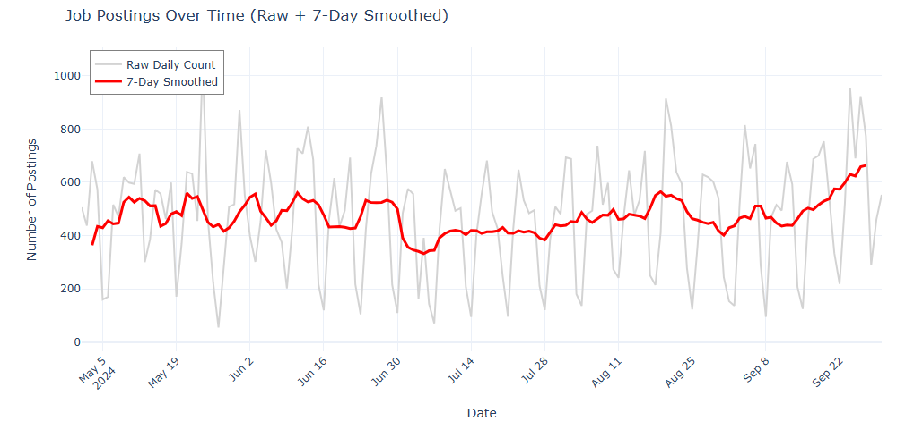

___

# STOPAS LAB 6
___

What this image shows is that employees in full-time roles generally earn more than those with part-time jobs. This result is also intuitive and makes logical sense. It is unclear what the category of ‘Part time / full-time’ represents

___

The plot shows the STARTING_FROM salary for the various industries indicated in the NAICS2_NAME column. One can see some very high starting ‘from’ salaries in the administrative and support and waste management and remediation services category, and also health care and social assistance.

___

This shows the jobs posted per day in the dataset, indicating a general upward trend. While the top day of the week varies slightly from day to day the lowest days (amount posted) are, in general, always on Sundays.

___

This bar chart is generally easy to read and shows the viewer that ‘Data Analysts’ is the top job title in the dataset, by a lot...
___

It appears that in this case a lot of the information is missing concerning whether a job posting has indicated if it is remote or not (with 'None' being the major category). For the purposes of the pie chart, I’m showing the main category of 'None' (along with the few NaN values in there) as Unknown.

___

There are 44173 skills in the SKILLS_NAME column. To make this plot readable and help to understand the question I’m showing the top 15 industries by count of skill mentions

___

The only ONET_NAME category, when filtered for salary information, is Business Intelligence Analysists. When not filtered for salary information it’s Business Intelligence Analysists and null.
___

Same thing here it appears that both SOC_2021_2_NAME and SOC_2021_3_NAME contain the entire dataset, making a plot of this kind generally uninformative

___
